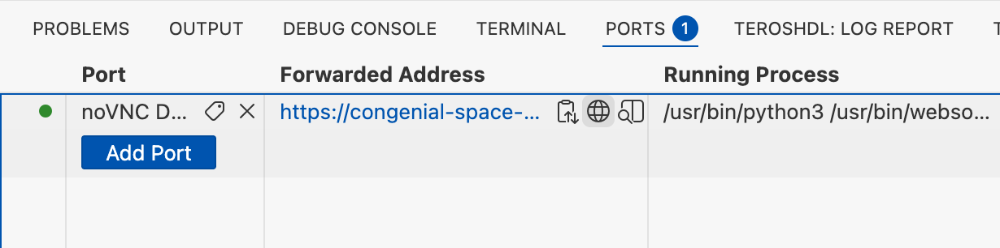
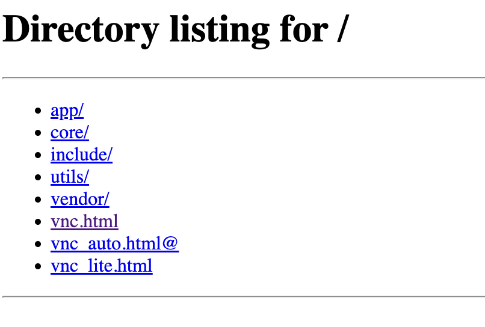
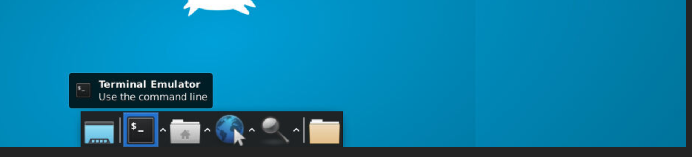
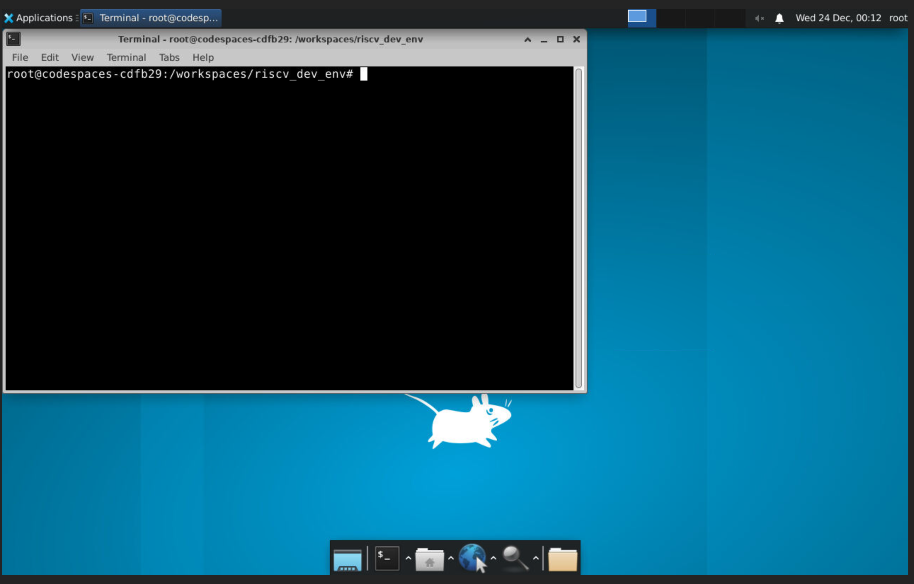
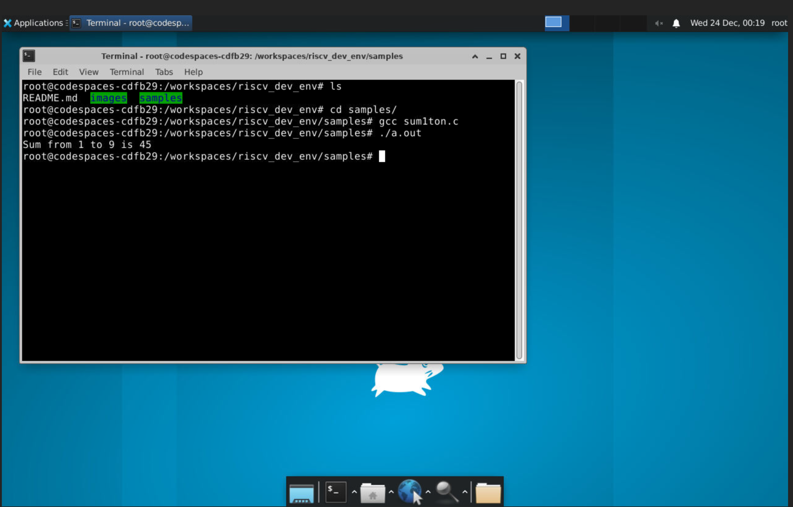
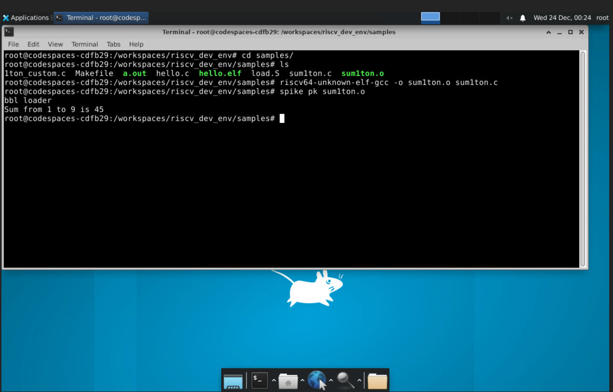
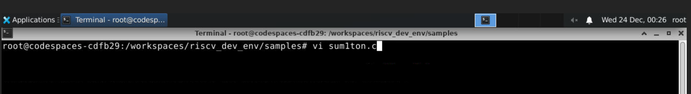
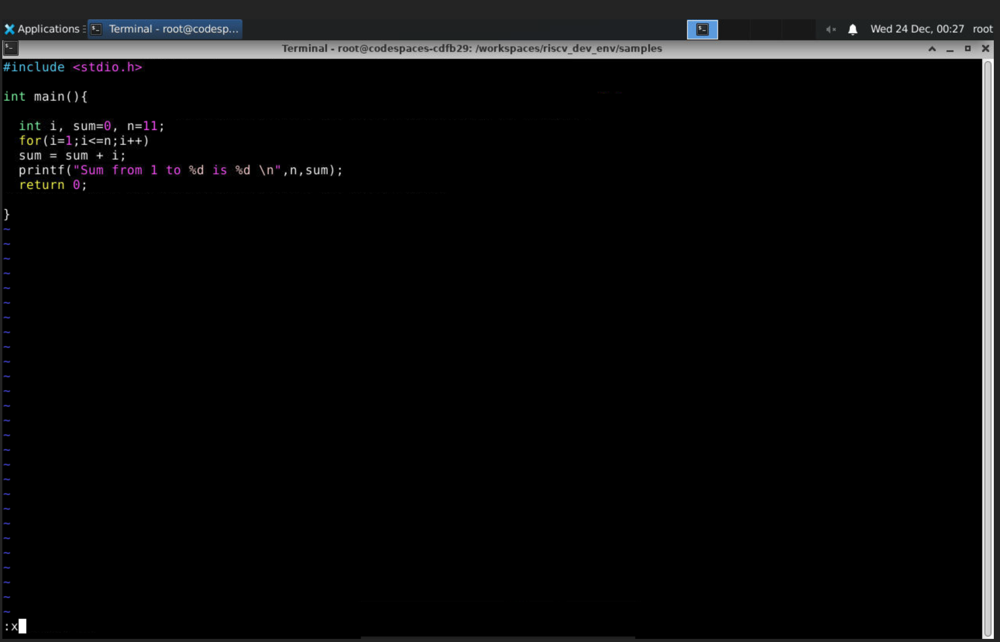
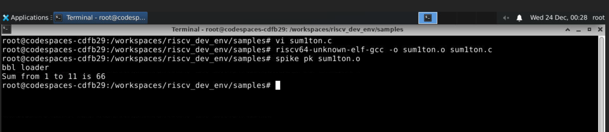

# Getting Started with RISC-V on GitHub Codespaces

Follow the steps below to set up and run programs in your own Codespace.

---

## Step 1. Open the Repository

Go to:  
[https://github.com/davidbroughsmyth/riscv_dev_env](https://github.com/davidbroughsmyth/riscv_dev_env)

---

## Step 2. Create a Codespace

1. Log in with your GitHub account.
2. Click the green **Code** button.
3. Select **Open with Codespaces** → **New codespace**.
4. Wait while the environment builds. (First time may take 10–1 minutes ... sometimes heaps more.)

---

## Step 3. Verify the Setup

In the terminal that opens, type:

```bash
riscv64-unknown-elf-gcc --version
spike
iverilog -V
````

You should see version information for each tool.

---

## Step 4. Run Your First Program

1. Go to the `samples` folder.
2. Compile the program:

   ```bash
   riscv64-unknown-elf-gcc -o sum1ton.o sum1ton.c
   ```
3. Run it with Spike:

   ```bash
   spike pk sum1ton.o
   ```

Expected output:

```text
Sum from 1 to 9 is 45
```

---

## Step 5. Next Steps

* You can edit and run your own C programs.
* You can also try Verilog programs using `iverilog`.

---

# Working with GUI Desktop (noVNC) – Advanced

The following steps show how to use a full Linux desktop inside your Codespace and run the same RISC-V programs there.

---

## Step 6. Launch the noVNC Desktop

1. In your Codespace, click the **PORTS** tab.

2. Look for the forwarded port named **noVNC Desktop (6080)**.

3. Click the **Forwarded Address** link and click the little world sphere icon.

   

4. A new browser tab opens with a directory listing. Click **`vnc.html`** and in the new browser tab click connect, or just click **`vnc_lite.html`**.

   

5. The Linux desktop appears in your browser, then select a terminal from the bottom menu.

   

---

## Step 7. Open a Terminal Inside the Desktop

1. Or right-click anywhere on the desktop background.
2. Select **Open Terminal Here**.

   

A terminal window will open on the desktop.

---

## Step 8. Navigate to the Sample Programs

In the terminal, go to the workspace and then to the `samples` folder:

```bash
cd /workspaces/riscv_dev_env
cd samples
ls -ltr
```

You should see files like `sum1ton.c`, `1ton_custom.c`, `load.S`, and `Makefile`.



---

## Step 9. Compile and Run Using Native GCC (x86)

First, compile and run the C program with the standard `gcc` compiler:

```bash
gcc sum1ton.c
./a.out
```

Expected output:

```text
Sum from 1 to 9 is 45
```



---

## Step 10. Compile and Run Using RISC-V GCC and Spike

Now compile the same program for RISC-V and run it on the Spike ISA simulator:

```bash
riscv64-unknown-elf-gcc -o sum1ton.o sum1ton.c
spike pk sum1ton.o
```

You will see the proxy kernel (`pk`) messages and then the program output.



---

## Step 11. Edit the C Program Using vi  or any othere editor

To edit the program using the vi editor:

```bash
vi sum1ton.c
```

This opens `sum1ton.c` in **vi** on the noVNC desktop.



Make changes (for example, change `n = 9;` to another value), save the file (esc x for vi), and re-run:



```bash
riscv64-unknown-elf-gcc -o sum1ton.o sum1ton.c
spike pk sum1ton.o
```


---

You have now:

* Launched a full Linux desktop inside GitHub Codespaces
* Compiled and executed a C program with native GCC
* Compiled and executed the same program on a RISC-V target using Spike
* Edited and rebuilt the code using a GUI editor over noVNC

You’re ready to explore more RISC-V and Verilog labs in this Codespace.


